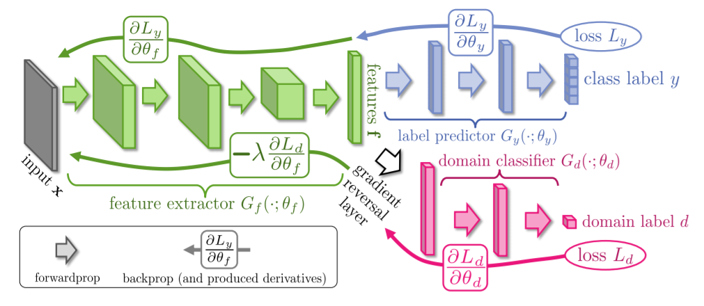
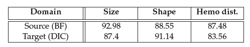

# DANN

This project includes Domain Adversarial Neural Network (DANN) for Hemoglobin distribution. Unsupervised domain adaptation is carried out to predict DIC (Unstained) labels in presence of labelled BF (Stained) data and unlabelled DIC data. The matching between crops should not always be the solution to get DIC labels. In this task, model trained on BF data is used in the context of a DIC data. With the progress in training, discriminative and domain-invariant deep features are emerged. The success in adaptation depends on level of relatedness between the source (BF) and target (DIC) domains. 

# Network

The network consists of feature extractor and two classifier heads, namely, label predictor and domain classifier. Pretrained EfficientNet-B7 is used as feature extractor. Label predictor and domain classifier are with 1 fully connected and 2 fully connected layers respectively. The label predictor predicts class labels and domain classifier discriminates between source and target domains. Adaptation behaviour is achieved by placing gradient reversal layer between feature extractor and domain classifier that doesn’t change the input during forward propagation, but reverses the gradient by multiplying it by a negative scalar during the backpropagation.

 

This network consists of two losses, the classification loss and the domain confusion loss. The classification loss is minimized for source samples and the domain confusion loss is minimized for all samples (while the domain confusion loss is maximized for feature extraction), ensures that the samples are made mutually indistinguishable for the domain classifier.

The latent feature space for multi-output scenario is very complex and to get domain-invariant features in that space is hard. The complex multi-output classification problem is broken down to multi-class problems. Three different DANN networks are trained for prediction of cell size, shape and hemogloin distribution individually. This project shows domain adaptation for hemoglobin distribution. It can be easily modified by supplying respective classification loss for other cell property.

# Training

Standardized full crop input of BF and DIC data is used as source and target samples accordingly. During training, cross entropy losses for label and domain prediction are calculated from each sampled batch of BF input, while only domain cross entropy loss is included from DIC input. Batch size and number of epochs are set as 16 and 30 respectively. After each epoch, validation accuracy using DIC input of 2183 crops is calculated. The model with good DIC validation accuracy is chosen as best performing model.

# Results

This project performs domain adapatation for hemoglobin distribution only. It can easily be modified for Size and Shape. The below table shows results from source and target domain for Size, Shape and Hemo dist. Classifiers trained separately.

 

Domain adaptation becomes challenging for Hemoglobin distribution classification as internal cell structure is involved, unlike Size and Shape classification. Also, the features are not clearly visible in DIC crops making it difficult for emergence of good domain-invariant features.
