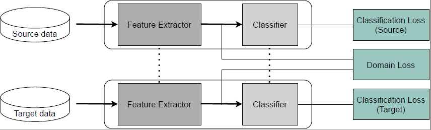
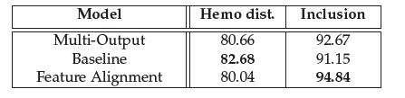
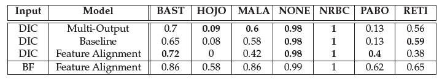
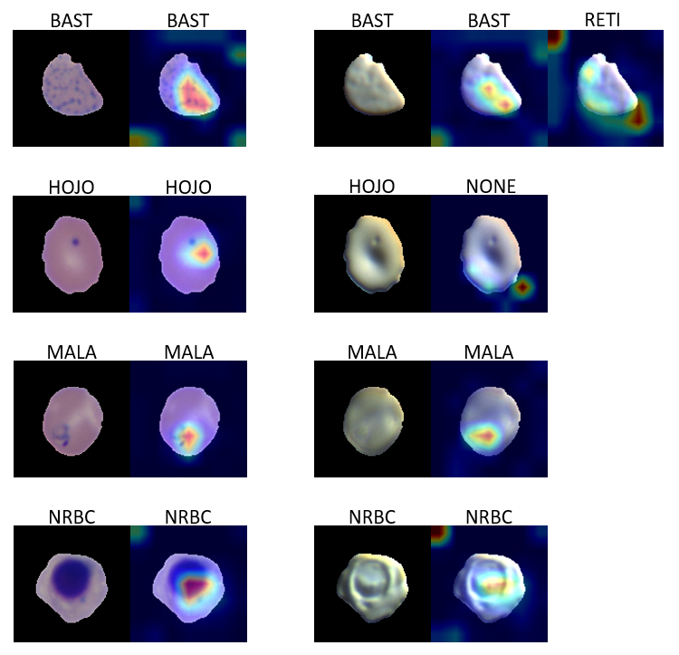

# Feature_Alignment

DIC performance is less for Hemoglobin distribution and Inclusion prediction in comparison to BF results. So, feature alignment is performed in latent space by minimization of MMD(Max. Mean Discrepancy) distance between feature distributions. The objective of this task is to improve DIC performance using network additional information from BF domain. BF and DIC crops become source and target data respectively.

## Network
Classification Network using Feature Alignment. It includes feature extractor and classifier. The dotted lines indicate that the network parameters are shared. Two Classification loss terms are minimized for source and target samples and Domain loss term directly minimizes the distance between source and target representations.

 

## Training
The model is trained to predict the class labels for both domains while simultaneously finding a representation that makes them indistinguishable. Normalized center cell input in range [0,1] is considered to allow only center cell features into account. During training, each sampled batch with same input from two domains is passed through network individually. We trained to improve Inclusion performance of DIC crops. It can be easily modified to improve DIC Hemoglobin distribution performance.

Baseline model is trained separately to check improvement in DIC performance. This model will only have target Inclusion loss. Comparison is made between three different models, namely, Multi-Output Classification model, Baseline model and Feature Alignment model.

## Results
The results from 3 different models are shown in table below. This project deals only with Feature Alignment performed for Inclusion classifier. It can be implemented in same way for hemoglobin distribution classifier as well.

 

Accuracy is not a good metric for comparison especially with imbalanced dataset. F1 scores for Inclusion labels are tabulated below obtained from different models. The results from Feature Alignment model with BF crops is also tabulated. There is no big improvement in performance for Feature Alignment model with DIC crops. In general, all models with DIC input show significant performance drop in comparison to Feature Alignment
model with BF input. As features are not clearly visible in DIC crops, the performance cannot be improved using Feature Alignment.

 

## Visualization of Heatmaps 
Gradient Class Activation Map (Grad-CAM) is used for visualization of Heatmaps. For implemenation, Simple Pretrained Resnet50 on ImageNet dataset is used as feature extractor. The training procedure is exactly the same. The last convolutional layer of network will have spatial size of 4x4 with our center cell input (120x120 spatial size). Thus, only heatmap of 4x4 grid can be obtained. Such low spatial heatmap mostly activates only one particular grid at center, as we have center cell input. So, the center cell crop is resized to 224x224 to get 7x7 spatial size in final convolutional layer. As a result, the produced heatmap will be of grid size 7x7 with possibly many activations. Better visualization of important regions can be observed, if this heatmap is interpolated and visualized on input image.

 

The predictions are good for BF crops with heatmaps focusing on areas of interest. But, this is not observed with DIC crops. This concludes that DIC crops have some missing details in comparison to BF crops.
