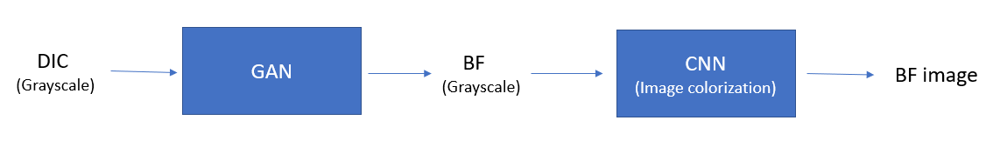
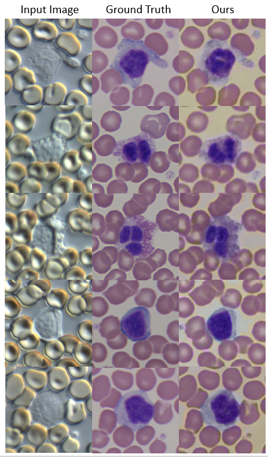

# pix2pixHD and Image colorization

This project is an experiment carried out to convert DIC image to BF image. In short, it is digital staining on White blood cell DIC crops.

The project is comprised of 2 parts. Firstly, pix2pixHD generates BF grayscale images from DIC grayscale images. Then, colorization network colorizes generated BF grayscale images.

The results of image conversion from DIC to BF using colorization is shown below. Ofcourse, pix2pixHD can be used to directly convert DIC color to BF color image. But, we used pix2pixHD to convert only DIC grayscale to BF grayscale image, which reduces the complexity and then, used colorization network to get BF color image.

**Note:** We can see slightly yellowish color in background in predictions for some pixels. The training data had some white and yellowish background. We need to effectively select training images to have proper prediction background.
