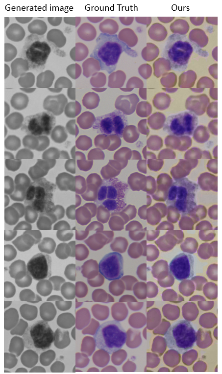

## Image Colorization

We colorize BF (stained) grayscale images generated from pix2pixHD GAN network. We work in the _lab_ colorspace for image colorization. 

**Advantages:**
- we have the grayscale image (l channel) as input 
- complexity of the color channels is reduced from three rgb channels to two ab channels.

We discretize the rgb space to ab space in the form of buckets. And we try to predict the bucket index for each pixel.
The idea is from [Colorful Image Colorization](https://arxiv.org/abs/1603.08511) paper.

We use [MobileNetv2](https://arxiv.org/abs/1801.04381) in combination with [deeplabv3](https://arxiv.org/abs/1706.05587) as our colorization network.

Below are the results from colorization network:

In the predicted image, the background colour is altered for some pixels. This is because the background colour was not uniform for all pixels in training images.
