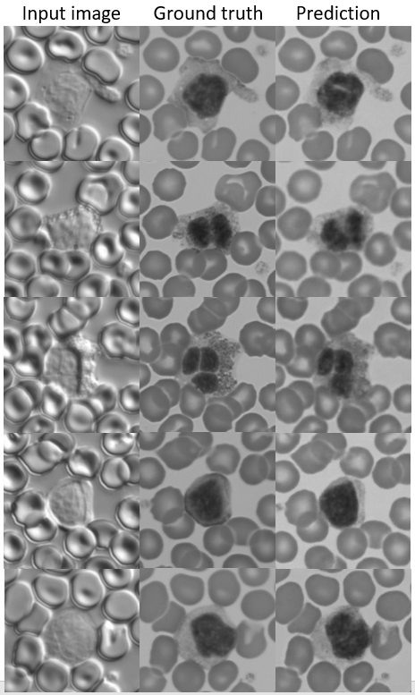

We convert DIC (unstained) grayscale image to BF (stained) grayscale image using [pix2pixHD](https://arxiv.org/pdf/1711.11585.pdf) network.

**Training:**

`python train.py --label_nc 0 --no_instance --name graychannel --dataroot ./datasets/graychannel --no_flip --save_epoch_freq 5`

Place the training_data folder inside datasets/graychannel. train_A and train_B are DIC and BF grayscale images respectively.

**Testing:**

`python test.py --dataroot ./datasets/graychannel --name graychannel --netG global --label_nc 0 --no_instance --how_many 100 --which_epoch 100`

We will have test_A (DIC grayscale) as input inside datasets/graychannel for testing. We can see the GroundTruth and prediction of test image below.

**Reference:**

[Source Github Repo](https://github.com/NVIDIA/pix2pixHD)

