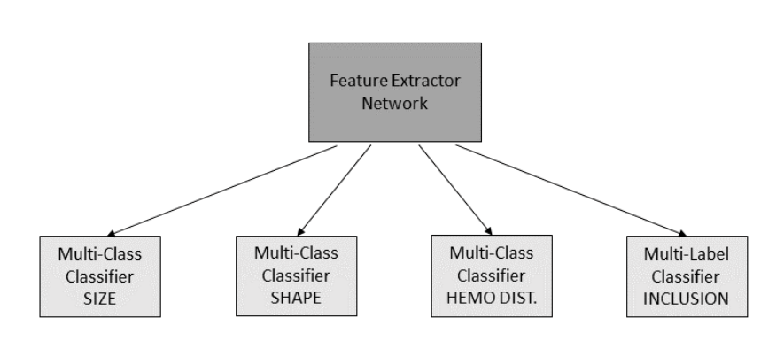
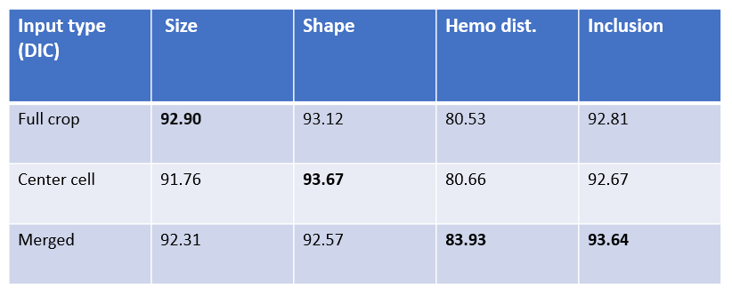
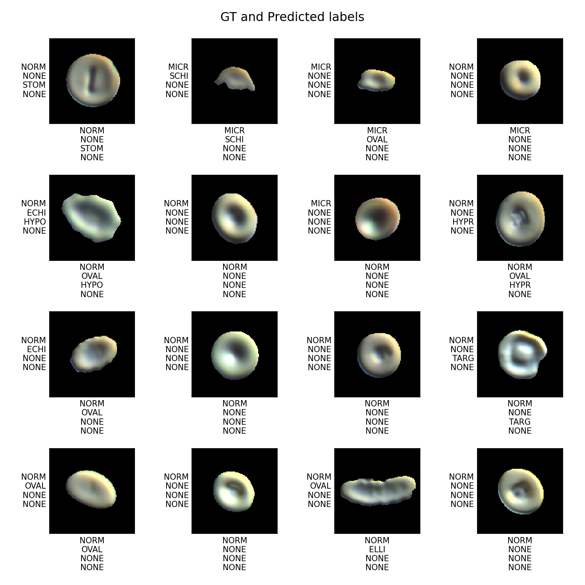

# RBC_MultiOutput_Classification_Unstained

MultiOutput Classification of UnStained (DIC) Red blood cells for all types of input (Full crop, Center cell and Merged type). For each crop, we get Size, Shape, Hemoglobin distribution and Inclusion as predictions.

# RBC Multi-Output Classification for Unstained (DIC) crops

This project includes MultiOutput Classification of DIC crops for all types of input (Full crop, Center cell and Merged type). For each crop, we get Size, Shape, Hemoglobin distribution and Inclusion as prediction labels. From each classifer, we have one prediction label. From Inclusion (multi-label) classifer, we might get multiple predictions. So, we have multi-output and multi-label classifiers in our network. The overview of network is shown below. We have 4 classifier heads from the backbone network [(EfficientNet- b7)](https://arxiv.org/abs/1905.11946)

 

## Dataset

The good full crop and good center cell images from the pre-classification network is our dataset. We didn't perform preclassification exclusively on DIC crops. Since we have matching between BF and DIC crops, the good classified crops from BF domain are matched with DIC crops. Then, we get good full crop and good center cell DIC crops.

## Data preparation

There are many normal crops in our dataset. So, we undersample 50% of normal crops. Also, we have only few labels for some crops, we do random oversampling of such crops for each variation to certain number of samples. This will be used for our training _data/train_processed_new_clean1.csv_. Refer the _data_preparation.ipynb_ notebook.

## Training

We use median frequency balncing for each variation to encounter class-imbalance. We have the flexibilty to choose any input (full crop, center cell, merged) for training with key value from dictionary item. We train for three different input types (full crop, center cell, merged type) separately and compare the models. While using merged type, change input channels of network to 6 and feed the corresponding input to model. All types of input for sample is available inside dictionary item along with labels.

## Results

The table below shows the accuracy for all variations from different input types. From the below result, we can go ahead with merged input as the results seem better. It takes advantages of full crop and center cell in picking the features. Clearly, the hemoglobin and Inclusion accuracy are low in comparison with BF resuts. This is because DIC crops have fewer details in comparison to BF crops.

 

The below result shows the predictions for crops from merged input type. For visualization, we used the center cell display. _x-axis_ shows the predictions and _y-axis_ shows the ground truth for all crops. We have labels in this order (size, shape, hemoglobin distribution and inclusion) for each crop.

 

