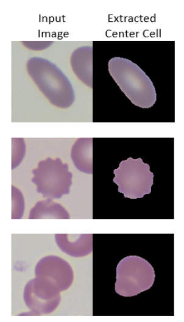
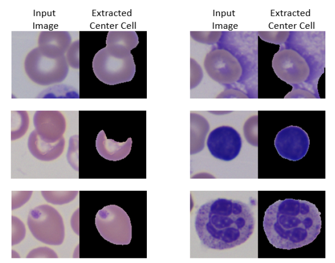

# RBC pre-classification

## Why pre-classification?
The extracted center cell from segmentation and post-processing might not be proper. This occurs, when the center cell is overlapping (bad monolayer) with other cell. So, we concatenate center cell crop and corresponding full crop as input to network to decide whether the crop is good/bad image. We call this concatenation as merged input type. Also, WBC, platelets on or touching center cell, artifact crops are considered as bad images. Some of the examples of good/bad images are shown below.

### Good crops
Examples of good crops are shown below. First input image show well separated cells. Second and third input image shows touching and overlapping cells. For all cases, center cell is extracted properly. In case of bad monolayer, the center cell can be extracted properly without losing any portion of cell. Here, the size and shape of the cell are not altered. This is considered as good image, as shown below. Other way round, if the center cell lose some portion, it will be bad image.

### Bad crops
Examples of bad crops are shown below. First row on left show image with center cell not extracted. Second row on left show image where part of cell is lost. Cell with platelet on top is shown by third row on left image. First and second row on right shows image with artifact. Third row on right display WBC.

Pre-classification network classifies image (feeded as merged type input) into good or bad image. Only good images will be analyzed later for multi-output classification.

## Network
We used [EfficientNet-b7](https://arxiv.org/abs/1905.11946) as our preclassification network with 6 channel input (merged input type). It is a binary classification network, which classifies input to good or bad image.

## Training
We used the unlabelled images from CDB and EH5 samples for training the network. They are manually classified and put inside _center_cell_good_ and _center_cell_bad_ folders. Few samples from labelled images (malaria cells, NRBCs) are also used for training, as they are not present inside unlabelled images. Run the notebook _classification.ipynb_ for training the model 

## Testing
We test the model on labelled images from CDB and EH5 samples. The classified good images will be considered later for multi-output classification.
Run the notebook _classification_testing.ipynb_. The data to be tested is inside _data_ folder. CLassification result (good full crop and good center cell crops) is also present inside _data_ folder.
