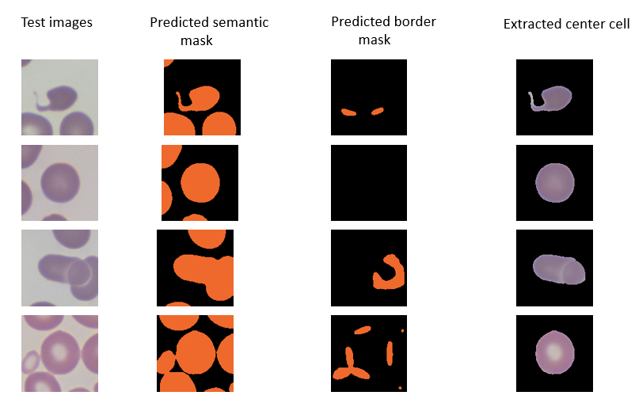

# Segmentation and Center cell Extraction from crop

**Purpose:** The noisy background apart from the center cell in the crop is irrelevant for cell classification. So, we try to do segmentation and then, extract only center cell from the crop.

## Training and Validation:
Run the notebook _1_segmentation_nn.ipynb_ for generating UNet models

**Model 1:** Semantic segmentation of UNET with 2 classes (Background, Anything other than background)

**Model 2:** UNET trained to detect Borders between cells. Also has 2 classes (Background, Border)

## Testing:
Run the notebook _testing.ipynb_, which uses UNet models to extract center cell on labelled test crops.

We combine the semantic segmented image and border image predicted from both models, to get center cell image. 
In case, there is no border predicted between cells, the center of contour closest to center of crop in semantic segmented image, will be our center cell. Using this mask, we can extract center cell from test input image.

**Center Cell Extraction:**

From the border predicted image, we fit polynomials to each contour and use them as inverse masks on semantic segmented image. Thus, we can divide the contours of cells touching or overlapping in the image and in turn, can extract only center cell from the image. Incase, we can't fit polynomial to contour( for example, because of 3 cells interaction), we skeletonize the contour in border image and divide the cell contours on semantic segmented image.
Then, the center of contour closest to center of crop in semantic segmented image will be center cell mask. This is placed on test input image, to get only center cell.

## Results
1st column - Test image

2nd column - Result from Model 1 - Semantic predicted image

3rd column - Result from Model 2 - Border predicted image

4th column - Center cell extracted image using Semantic and border predicted images

